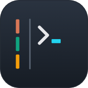
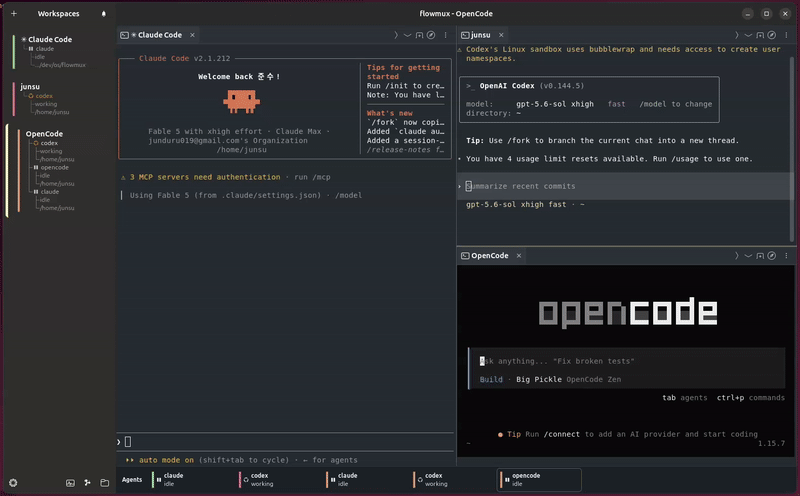

<div align="center">
  
# FlowMux


**Agent Workflow Multiplexer Terminal** — *Go with the agents' flow.*


</div>

### A terminal for AI agent workflows, browser control, and task signals.

flowmux is a Linux/GTK4 terminal with tabs and notifications for AI coding agents.

> It is an unofficial GPL-3.0-or-later reimplementation inspired by [cmux](https://cmux.com/ko), a macOS/AppKit app, and is not affiliated with cmux.
  
## Control internal browser

flowmux ships a WebKitGTK 6.0 browser tab that lives next to terminal tabs in
the same pane tree. The clip below shows an AI agent driving the page through
flowmux's IPC socket — snapshot the DOM, click, type, read state back — with
no system Chromium and no separate driver process.


## AI Agent notification(Claude, Codex, OpenCode)

flowmux installs lifecycle hooks into Claude Code, Codex, and OpenCode so
events like *task complete*, *needs approval*, and *error* surface as native
desktop notifications. Each notification is routed to the workspace that
fired it, suppressed while its surface is focused, and isolated per flowmux
window so multiple sessions don't bleed into each other.



## Features

### Workspaces & panes
- Side-panel workspaces keep several tasks side by side, and each one
  can be split into as many panes as you need.
- Terminal tabs and browser tabs share the same pane tree, and you can
  jump between panes from the keyboard.

### In-app browser
- A browser tab lives inside flowmux next to your terminals — no need
  to open a separate Chromium just to view or interact with a page.
- AI agents in a neighbouring pane can drive that browser directly:
  snapshot the page, click, type, scroll, and read state back.
- Import an existing session from Firefox, Chrome, Chromium, Brave,
  Edge, or Arc so you stay logged in to the sites you already use.

### Notifications
- "Task complete" and "needs attention" signals from a terminal turn
  into native desktop notifications.
- Each notification is routed to the workspace that fired it, stays
  quiet while you are already looking at that pane, and the sidebar
  highlights workspaces that need your attention.

### AI agent integration
- Claude Code, Codex, and OpenCode are wired up out of the box, so
  completion, approval, and error events surface as notifications you
  actually see.
- Agent sessions are remembered across restarts, so a resumed
  workspace lands back on the right pane.
- `claude-teams` opens a workspace pre-split into several panes, each
  running its own Claude instance.

### Scripting & automation
- The `flowmux` command line covers the same surface the GUI exposes:
  open workspaces, split panes, drive the in-app browser, send
  notifications, manage themes.
- Commands can return JSON, so shell scripts and agents can consume
  the results directly.

### Config & persistence
- Reads `cmux.json` for custom commands and picks up your Ghostty
  fonts and colours from `~/.config/ghostty/config`.
- Workspaces, panes, and themes are remembered between launches.

## Layout

```
flowmux/
├── crates/
│   ├── flowmux-core/       Domain types: Workspace, Surface, Pane, Notification
│   ├── flowmux-config/     cmux.json + ~/.config/ghostty/config readers
│   ├── flowmux-state/      Persistent workspace/session state on disk
│   ├── flowmux-terminal/   Terminal backend trait + vte4 / libghostty backends
│   ├── flowmux-browser/    WebKitGTK 6.0 browser surface + scriptable refs
│   ├── flowmux-cookies/    Browser cookie/session import (libsecret + sqlite)
│   ├── flowmux-notify/     OSC 9/99/777 parser + libnotify D-Bus sender
│   ├── flowmux-ipc/        Unix-socket IPC (cmux socket-API compatible)
│   ├── flowmux-daemon/     Background daemon orchestrating IPC and panes
│   ├── flowmux-procmon/    PID-tree process / listening-port monitor
│   ├── flowmux-ssh/        SSH workspaces via russh
│   ├── flowmux-vcs/        Git/PR sidebar integration
│   ├── flowmux-cli/        `flowmuxctl` helper for CLI subcommands
│   └── flowmux/            GTK4 + libadwaita main app and public `flowmux` binary
├── packaging/{debian,flatpak}/  Distro packaging metadata
├── resources/             .desktop file, icons, screenshots, themes
├── LICENSE                GPL-3.0-or-later (verbatim from gnu.org)
├── THIRD_PARTY_LICENSES.md  Third-party dependency license inventory
└── NOTICE                 Copyright + attribution
```

## Build prerequisites (Ubuntu 24.04+)

```bash
sudo apt install \
    build-essential pkg-config \
    libgtk-4-dev libadwaita-1-dev libvte-2.91-gtk4-dev \
    libwebkitgtk-6.0-dev libssl-dev \
    libssh2-1-dev libdbus-1-dev
# rustup (stable toolchain)
curl --proto '=https' --tlsv1.2 -sSf https://sh.rustup.rs | sh
```

### Recommended (optional) — full media playback in tab browser

WebKitGTK delegates media decoding to GStreamer. Without these
plugins the tab browser still loads pages, but YouTube / Twitch /
HTML5 `<video>` may stall, miss subtitles, or fail on
encrypted/DRM content. Install them if you plan to play video:

```bash
sudo apt install \
    gstreamer1.0-plugins-good \
    gstreamer1.0-plugins-bad \
    gstreamer1.0-plugins-ugly \
    gstreamer1.0-libav
```

The exact symptoms when missing: log lines like
`GStreamer element fakevideosink not found` or
`WebKit wasn't able to find a WebVTT encoder. Subtitles handling
will be degraded unless gst-plugins-bad is installed.`

## Build

```bash
# release build of the GUI app and the CLI helper
cargo build --release -p flowmux -p flowmux-cli
```

The release profile produces two binaries under `target/release/`:

- `flowmux` — the GTK4 GUI; also forwards CLI subcommands to `flowmuxctl`.
- `flowmuxctl` — the CLI helper invoked by the GUI binary and by agent hooks.

For day-to-day development you can skip the install step:

```bash
cargo run -p flowmux           # debug GUI
cargo check --workspace        # type-check everything
```

## License

GPL-3.0-or-later. See [`LICENSE`](LICENSE) and [`NOTICE`](NOTICE).
Contributions are accepted under the same license; see
[`CONTRIBUTING.md`](CONTRIBUTING.md).
