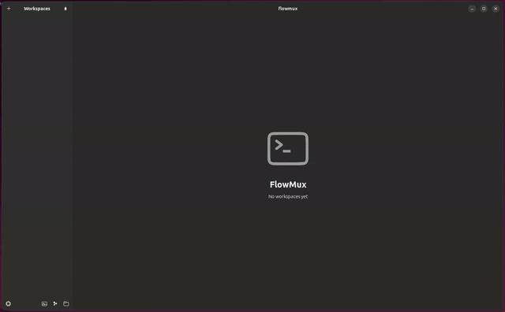
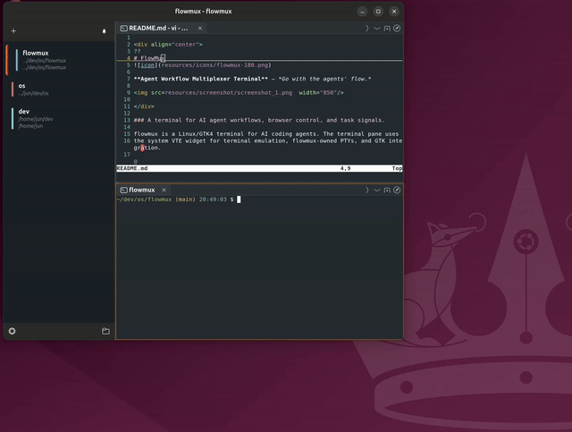

<div align="center">
  
# FlowMux


**Agent Workflow Multiplexer Terminal** — *Go with the agents' flow.*

[Website](https://flowmux-ai.github.io/) · [Latest release](https://github.com/flowmux-ai/flowmux-terminal/releases/latest)


</div>

### A terminal for AI agent workflows, browser control, and task signals.

flowmux is a Linux/GTK4 terminal for AI coding agents. The terminal pane uses
the system VTE widget for terminal emulation, flowmux-owned PTYs, and GTK integration.
Supported on Ubuntu 24.04 and later.

> Unofficial GPL-3.0-or-later reimplementation inspired by [cmux](https://cmux.com/ko), a macOS/AppKit app. Not affiliated with cmux.
  
## Control internal browser

A WebKitGTK 6.0 browser tab lives next to terminal tabs in the same pane tree.
The clip shows an AI agent driving the page over flowmux's IPC socket —
snapshot the DOM, click, type, read state back — with no system Chromium and
no separate driver.


## AI Agent notification (Claude, Codex, OpenCode)

flowmux installs lifecycle hooks into Claude Code, Codex, and OpenCode so
*task complete*, *needs approval*, and *error* events surface as native
desktop notifications — routed to the workspace that fired them, suppressed
while that surface is focused, and isolated per window.


## Split panes

Split a pane horizontally or vertically and drag the divider to resize. Mix
terminal and browser tabs across panes, and navigate between them from the
keyboard.



## Image viewer

Ctrl+click an image path in a terminal pane to preview it inline without
leaving flowmux. Supports **PNG, JPEG, WebP, GIF, SVG, and Lottie**
(`.lottie` / `.json`). Everything is drawn by
[ThorVG](https://www.thorvg.org/): PNG / JPEG / WebP / SVG are decoded and
rendered by ThorVG's own loaders, Lottie plays back frame by frame, and GIF
(which ThorVG has no loader for) is decoded with the Rust `image` crate and
then handed to ThorVG to render. ThorVG is an optional runtime dependency — see
[ThorVG (image viewer — optional)](#thorvg-image-viewer--optional).


## Markdown viewer

`flowmux-md-viewer` renders Markdown files in a WebKit view for a formatted,
scrollable preview.



## Features

- **Workspaces & panes** — side-panel workspaces hold tasks side by side, each
  split into multiple keyboard-navigable panes mixing terminal and browser
  tabs. `Ctrl+Shift+K` copies the focused cwd; right-click for Copy path / URL.
- **In-app browser** — a WebKitGTK tab next to your terminals, drivable by
  agents in a neighbouring pane (snapshot, click, type, read state). Import a
  session from Firefox / Chrome / Chromium / Brave / Edge / Arc; **Web
  Inspector** opens WebKit dev tools.
- **Notifications** — terminal "task complete" / "needs attention" signals
  become desktop notifications, routed to the firing workspace and quiet while
  focused. Bell popover **All Clear** clears all entries and toasts at once.
- **AI agent integration** — Claude Code, Codex, OpenCode work out of the box;
  sessions persist across restarts. `claude-teams` opens a workspace pre-split
  into per-Claude panes. `flowmux doctor` / `fix` audit and repair wiring.
- **Agent CLI** — scripts and agents drive flowmux over its socket:
  `flowmux browser <op>` (snapshot / click / fill / type / press /
  is-visible / count / …), `flowmux identify` and `capabilities` for context
  discovery, `flowmux tree` to inspect the workspace → pane → tab structure,
  `workspace current|focus`, `focus-pane|close-pane`, `focus-tab|close-tab`,
  `send-keys`, and `read-screen` (terminal buffer dump). Pane args accept
  `pane:<uuid>` or fall back to
  `$FLOWMUX_PANE_ID`; `--json` everywhere. Full contract in
  [`AGENTS.md`](AGENTS.md).
- **Customizable keybindings** — Options → **Keybindings** rebinds any shortcut
  (applies on OK, no restart), saved to
  `$XDG_CONFIG_HOME/flowmux/options.json`. IME/scroll terminal shortcuts
  (Shift+Enter Hangul flush, smart PgUp/PgDn) are fixed and not editable. The
  AI Usage popover opens and closes with **Ctrl+Alt+U** by default
  (**Cmd+Alt+U** on macOS; `toggle-usage-popover` in the Keybindings options).

See the [keyboard shortcut reference](docs/keybindings.md) and
[configuration reference](docs/configuration.md).

## Layout

```
flowmux/
├── crates/
│   ├── flowmux-core/       Domain types: Workspace, Surface, Pane, Notification
│   ├── flowmux-config/     cmux.json + ~/.config/ghostty/config readers
│   ├── flowmux-state/      Persistent workspace/session state on disk
│   ├── flowmux-terminal/   VTE terminal integration + PTY env helpers
│   ├── flowmux-browser/    WebKitGTK 6.0 browser surface + scriptable refs
│   ├── flowmux-cookies/    Browser cookie/session import (libsecret + sqlite)
│   ├── flowmux-notify/     OSC 9/99/777 parser + libnotify D-Bus sender
│   ├── flowmux-ipc/        Unix-socket IPC (cmux socket-API compatible)
│   ├── flowmux-daemon/     Background daemon orchestrating IPC and panes
│   ├── flowmux-procmon/    PID-tree process / listening-port monitor
│   ├── flowmux-vcs/        Git/PR sidebar integration
│   ├── flowmux-cli/        `flowmuxctl` helper for CLI subcommands
│   └── flowmux/            GTK4 + libadwaita main app and public `flowmux` binary
├── packaging/{debian,flatpak}/  Distro packaging metadata
├── resources/             .desktop file, icons, screenshots, themes
├── LICENSE                GPL-3.0-or-later (verbatim from gnu.org)
├── THIRD_PARTY_LICENSES.md  Third-party dependency license inventory
└── NOTICE                 Copyright + attribution
```

## Build prerequisites (Ubuntu 24.04 native)

```bash
sudo apt install \
    build-essential pkg-config git \
    libgtk-4-dev libadwaita-1-dev libvte-2.91-gtk4-dev \
    libwebkitgtk-6.0-dev libssl-dev \
    libdbus-1-dev libsecret-1-dev
# rustup (Rust 1.93+) required.
curl --proto '=https' --tlsv1.2 -sSf https://sh.rustup.rs | sh
```

### ThorVG (image viewer — optional)

The image viewer loads **ThorVG** at runtime (`dlopen`). It is **optional** —
flowmux builds and runs without it; only the image viewer needs it, and shows a
"ThorVG is not installed" message until it is present (no rebuild needed).

On macOS, install the Homebrew package and restart FlowMux:

```bash
brew install thorvg
```

Ubuntu does not package ThorVG, so install it with the helper script (needs
`meson` + `ninja-build`):

```bash
sudo scripts/install-thorvg.sh     # ThorVG v1.0.6 → /usr/local, then restart flowmux
```

ThorVG must be built with the C API and all loaders; the script does that
(`meson -Dbindings=capi -Dloaders=all`). Where a distro packages such a build
you can use it instead — e.g. Debian `libthorvg-dev`, Fedora `thorvg`.

### Optional — full media playback in tab browser

WebKitGTK decodes media via GStreamer. Without these plugins pages still load,
but YouTube / Twitch / `<video>` may stall, miss subtitles, or fail on DRM:

```bash
sudo apt install \
    gstreamer1.0-plugins-good \
    gstreamer1.0-plugins-bad \
    gstreamer1.0-plugins-ugly \
    gstreamer1.0-libav
```

## Build

```bash
cargo build --release --workspace
```

Produces two binaries under `target/release/`:

- `flowmux` — GTK4 GUI; also forwards CLI subcommands to `flowmuxctl`.
- `flowmuxctl` — CLI helper invoked by the GUI and by agent hooks.

`flowmux read-screen` (terminal buffer dump) reads the viewport straight from
the VTE terminal buffer, so it works in every build.

For development:

```bash
cargo run -p flowmux           # debug GUI
cargo check --workspace        # type-check everything
scripts/check-ubuntu-compat.sh # Docker smoke check for 24.04/26.04
```

## macOS local install

The macOS build uses Homebrew GTK / libadwaita and the system
WebKit.framework for the browser pane. It installs a
regular app bundle plus CLI binaries:

```bash
brew install pkg-config gtk4 libadwaita
scripts/install-macos.sh --check
scripts/install-macos.sh
open "$HOME/Applications/FlowMux.app"
```

The script installs `FlowMux.app` under `~/Applications` and copies `flowmux`,
`flowmuxctl`, and `flowmux-md-viewer` to `~/.local/bin`.

### Install to the host

```bash
./install.sh                   # release-builds flowmux → installs binaries + app icon
```

This installs `flowmux`, `flowmuxctl`, and `flowmux-md-viewer` binaries to
`~/.local/bin` and `~/.cargo/bin`, plus the desktop entry
(`~/.local/share/applications/com.flowmux.App.desktop`) and the app icons
(`~/.local/share/icons/hicolor/…`) so flowmux appears in the app launcher.
It is a plain `cargo build --release` using
the system VTE library; no Zig toolchain or vendored terminal backend is
required. ThorVG (image viewer) is optional and loaded at runtime, so the build
does not depend on it; `install.sh` only prints a note if it is missing.

After installing, fully restart any running flowmux GUI to pick up the new
binary.

## Verify & repair

flowmux wires into host pieces: agent SKILL files, agent hooks, the browser
data dir, host browsers for the cookie importer, and the daemon socket.

```bash
flowmux doctor   # read-only audit; non-zero exit if anything needs fixing
flowmux fix      # re-install / refresh what doctor flagged
```

`doctor` prints one row per check with a status badge (`ok` / `fix` / `warn` /
`info`); `NO_COLOR=1` or piping disables colour. Run it after a flowmux
install/upgrade and after installing a new agent. `fix` is idempotent and
never clobbers hand-edited entries lacking the flowmux marker. Add `--json` to
either for machine-readable output.

### Troubleshooting

Set `FLOWMUX_LOG=/path/to/flowmux.log` for a persistent diagnostic log.
Crash diagnostics are stored under `$XDG_STATE_HOME/flowmux/crashes` (usually
`~/.local/state/flowmux/crashes`). Start with `flowmux doctor`; it is read-only,
while `flowmux fix` repairs marked integration entries.

## WSL / WSLg

Ubuntu 24.04 and 26.04 on WSLg follow the native host path above:
install the build prerequisites, run `./install.sh`, then start
`flowmux` from the Linux side so GTK connects to WSLg's Wayland display. The
runtime detects WSL and enables the terminal key/resize workarounds that differ
from a regular GNOME session.

To verify a real WSLg session end to end on 24.04 or 26.04:

```bash
scripts/check-wslg-runtime.sh
```

That script installs the native host build if needed, launches the GUI through
WSLg, creates a workspace, and verifies `send-keys` / `read-screen` against the
live terminal pane. It uses a temporary `FLOWMUX_RUNTIME_DIR` for the smoke
run while leaving WSLg's `XDG_RUNTIME_DIR` alone, so it will not steal the
socket from an existing flowmux session or hide the Wayland socket. Use
`--no-install` to test an already-installed binary, or `--keep-open` to leave
the smoke GUI running and print the matching env for manual CLI checks.

## License

GPL-3.0-or-later. See [`LICENSE`](LICENSE) and [`NOTICE`](NOTICE).
Contributions accepted under the same license; see
[`CONTRIBUTING.md`](CONTRIBUTING.md).
